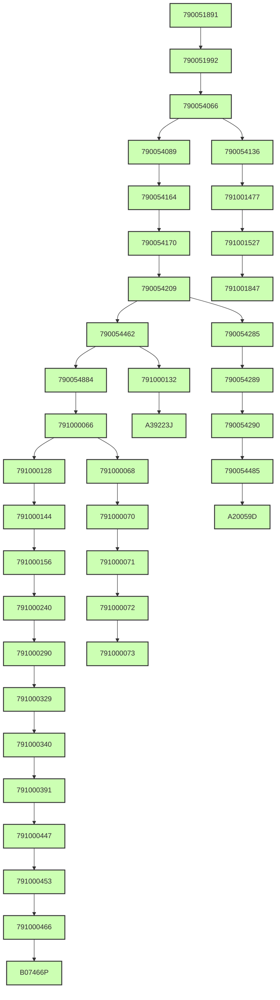

```mermaid
flowchart TD
%% Hardi Evrard
            790051891 --> 790051992
            class 790051891,790051992 green
            
%% Hardi Evrard
            790051992 --> 790054066
            class 790051992,790054066 green
            
%% Hardi Evrard
            790054066 --> 790054089
            class 790054066,790054089 green
            
%% Hardi Evrard
            790054089 --> 790054164
            class 790054089,790054164 green
            
%% Hardi Evrard
            790054164 --> 790054170
            class 790054164,790054170 green
            
%% Hardi Evrard
            790054170 --> 790054209
            class 790054170,790054209 green
            
%% Hardi Evrard
            790054209 --> 790054462
            class 790054209,790054462 green
            
%% Hardi Evrard
            790054462 --> 790054884
            class 790054462,790054884 green
            
%% Hardi Evrard
            790054884 --> 791000066
            class 790054884,791000066 green
            
%% Hardi Evrard
            791000066 --> 791000128
            class 791000066,791000128 green
            
%% Hardi Evrard
            791000128 --> 791000144
            class 791000128,791000144 green
            
%% Hardi Evrard
            791000144 --> 791000156
            class 791000144,791000156 green
            
%% Hardi Evrard
            791000156 --> 791000240
            class 791000156,791000240 green
            
%% Hardi Evrard
            791000240 --> 791000290
            class 791000240,791000290 green
            
%% Hardi Evrard
            791000290 --> 791000329
            class 791000290,791000329 green
            
%% Hardi Evrard
            791000329 --> 791000340
            class 791000329,791000340 green
            
%% Hardi Evrard
            791000340 --> 791000391
            class 791000340,791000391 green
            
%% Hardi Evrard
            791000391 --> 791000447
            class 791000391,791000447 green
            
%% Hardi Evrard
            791000447 --> 791000453
            class 791000447,791000453 green
            
%% Hardi Evrard
            791000453 --> 791000466
            class 791000453,791000466 green
            
%% Hardi Evrard
            791000466 --> B07466P
            class 791000466,B07466P green
            
%% Miller
            791000066 --> 791000068
            class 791000066,791000068 green
            
%% Miller
            791000068 --> 791000070
            class 791000068,791000070 green
            
%% Miller
            791000070 --> 791000071
            class 791000070,791000071 green
            
%% Miller
            791000071 --> 791000072
            class 791000071,791000072 green
            
%% Miller
            791000072 --> 791000073
            class 791000072,791000073 green
            
%% PH
            790054066 --> 790054136
            class 790054066,790054136 green
            
%% PH
            790054136 --> 791001477
            class 790054136,791001477 green
            
%% PH
            791001477 --> 791001527
            class 791001477,791001527 green
            
%% PH
            791001527 --> 791001847
            class 791001527,791001847 green
            
%% Hardi Evrard
            790054462 --> 791000132
            class 790054462,791000132 green
            
%% Hardi Evrard
            791000132 --> A39223J
            class 791000132,A39223J green
            
%% Hardi Evrard
            790054209 --> 790054285
            class 790054209,790054285 green
            
%% Hardi Evrard
            790054285 --> 790054289
            class 790054285,790054289 green
            
%% Hardi Evrard
            790054289 --> 790054290
            class 790054289,790054290 green
            
%% Hardi Evrard
            790054290 --> 790054485
            class 790054290,790054485 green
            
%% HARDI EVRARD
            790054485 --> A20059D
            class 790054485,A20059D green
            
classDef green fill:#ccffb3,stroke:#333,stroke-width:2px
```