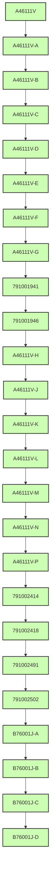

```mermaid
flowchart TD
%% Hardi Evrard
            A46111V --> A46111V-A
            class A46111V,A46111V-A green
            
%% Hardi Evrard
            A46111V-A --> A46111V-B
            class A46111V-A,A46111V-B green
            
%% Hardi Evrard
            A46111V-B --> A46111V-C
            class A46111V-B,A46111V-C green
            
%% Hardi Evrard
            A46111V-C --> A46111V-D
            class A46111V-C,A46111V-D green
            
%% Hardi Evrard
            A46111V-D --> A46111V-E
            class A46111V-D,A46111V-E green
            
%% Hardi Evrard
            A46111V-E --> A46111V-F
            class A46111V-E,A46111V-F green
            
%% Hardi Evrard
            A46111V-F --> A46111V-G
            class A46111V-F,A46111V-G green
            
%% Hardi Evrard
            A46111V-G --> 791001941
            class A46111V-G,791001941 green
            
%% Hardi Evrard
            791001941 --> 791001946
            class 791001941,791001946 green
            
%% Hardi Evrard
            791001946 --> A46111V-H
            class 791001946,A46111V-H green
            
%% Hardi Evrard
            A46111V-H --> A46111V-J
            class A46111V-H,A46111V-J green
            
%% Hardi Evrard
            A46111V-J --> A46111V-K
            class A46111V-J,A46111V-K green
            
%% Hardi Evrard
            A46111V-K --> A46111V-L
            class A46111V-K,A46111V-L green
            
%% Hardi Evrard
            A46111V-L --> A46111V-M
            class A46111V-L,A46111V-M green
            
%% Hardi Evrard
            A46111V-M --> A46111V-N
            class A46111V-M,A46111V-N green
            
%% Hardi Evrard
            A46111V-N --> A46111V-P
            class A46111V-N,A46111V-P green
            
%% Hardi Evrard
            A46111V-P --> 791002414
            class A46111V-P,791002414 green
            
%% Hardi Evrard
            791002414 --> 791002418
            class 791002414,791002418 green
            
%% Hardi Evrard
            791002418 --> 791002491
            class 791002418,791002491 green
            
%% Hardi Evrard
            791002491 --> 791002502
            class 791002491,791002502 green
            
%% Hardi Evrard
            791002502 --> B76001J-A
            class 791002502,B76001J-A green
            
%% Hardi Evrard
            B76001J-A --> B76001J-B
            class B76001J-A,B76001J-B green
            
%% Hardi Evrard
            B76001J-B --> B76001J-C
            class B76001J-B,B76001J-C green
            
%% Hardi Evrard
            B76001J-C --> B76001J-D
            class B76001J-C,B76001J-D green
            
classDef green fill:#ccffb3,stroke:#333,stroke-width:2px
```