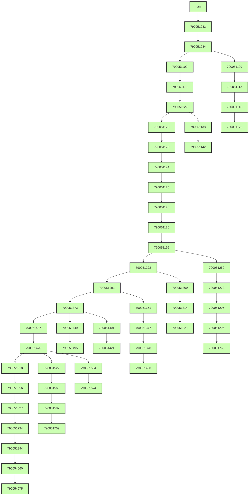

```mermaid
flowchart TD
%% Pellenc
            nan --> 790051083
            class nan,790051083 green
            
%% Pellenc
            790051083 --> 790051084
            class 790051083,790051084 green
            
%% nan
            790051084 --> 790051102
            class 790051084,790051102 green
            
%% Ingersoll-Rand
            790051102 --> 790051113
            class 790051102,790051113 green
            
%% Ingersoll-Rand
            790051113 --> 790051122
            class 790051113,790051122 green
            
%% nan
            790051122 --> 790051170
            class 790051122,790051170 green
            
%% Evrard
            790051170 --> 790051173
            class 790051170,790051173 green
            
%% Evrard
            790051173 --> 790051174
            class 790051173,790051174 green
            
%% Evrard
            790051174 --> 790051175
            class 790051174,790051175 green
            
%% Evrard
            790051175 --> 790051176
            class 790051175,790051176 green
            
%% Evrard
            790051176 --> 790051186
            class 790051176,790051186 green
            
%% nan
            790051186 --> 790051199
            class 790051186,790051199 green
            
%% nan
            790051199 --> 790051222
            class 790051199,790051222 green
            
%% nan
            790051222 --> 790051291
            class 790051222,790051291 green
            
%% nan
            790051291 --> 790051373
            class 790051291,790051373 green
            
%% nan
            790051373 --> 790051407
            class 790051373,790051407 green
            
%% Sands
            790051407 --> 790051470
            class 790051407,790051470 green
            
%% Sands
            790051470 --> 790051518
            class 790051470,790051518 green
            
%% nan
            790051518 --> 790051556
            class 790051518,790051556 green
            
%% Househam
            790051556 --> 790051627
            class 790051556,790051627 green
            
%% Drost
            790051627 --> 790051734
            class 790051627,790051734 green
            
%% Househam
            790051734 --> 790051894
            class 790051734,790051894 green
            
%% CPIL
            790051894 --> 790054060
            class 790051894,790054060 green
            
%% CML
            790054060 --> 790054075
            class 790054060,790054075 green
            
%% Pellenc
            790051084 --> 790051109
            class 790051084,790051109 green
            
%% Evrard
            790051109 --> 790051112
            class 790051109,790051112 green
            
%% AGCO
            790051112 --> 790051145
            class 790051112,790051145 green
            
%% AGCO
            790051145 --> 790051172
            class 790051145,790051172 green
            
%% Sands
            790051470 --> 790051522
            class 790051470,790051522 green
            
%% Grégoire
            790051522 --> 790051565
            class 790051522,790051565 green
            
%% Grégoire
            790051565 --> 790051587
            class 790051565,790051587 green
            
%% Grégoire
            790051587 --> 790051709
            class 790051587,790051709 green
            
%% nan
            790051470 --> 790051534
            class 790051470,790051534 green
            
%% nan
            790051534 --> 790051574
            class 790051534,790051574 green
            
%% nan
            790051222 --> 790051309
            class 790051222,790051309 green
            
%% PH
            790051309 --> 790051314
            class 790051309,790051314 green
            
%% PH
            790051314 --> 790051321
            class 790051314,790051321 green
            
%% nan
            790051373 --> 790051449
            class 790051373,790051449 green
            
%% nan
            790051449 --> 790051495
            class 790051449,790051495 green
            
%% Fluid System
            790051373 --> 790051401
            class 790051373,790051401 green
            
%% Préciculture
            790051401 --> 790051421
            class 790051401,790051421 green
            
%% Stavostroj
            790051122 --> 790051138
            class 790051122,790051138 green
            
%% Stavostroj
            790051138 --> 790051142
            class 790051138,790051142 green
            
%% nan
            790051291 --> 790051351
            class 790051291,790051351 green
            
%% nan
            790051351 --> 790051377
            class 790051351,790051377 green
            
%% nan
            790051377 --> 790051378
            class 790051377,790051378 green
            
%% nan
            790051378 --> 790051450
            class 790051378,790051450 green
            
%% nan
            790051199 --> 790051250
            class 790051199,790051250 green
            
%% nan
            790051250 --> 790051279
            class 790051250,790051279 green
            
%% nan
            790051279 --> 790051295
            class 790051279,790051295 green
            
%% nan
            790051295 --> 790051296
            class 790051295,790051296 green
            
%% nan
            790051296 --> 790051762
            class 790051296,790051762 green
            
classDef green fill:#ccffb3,stroke:#333,stroke-width:2px
```