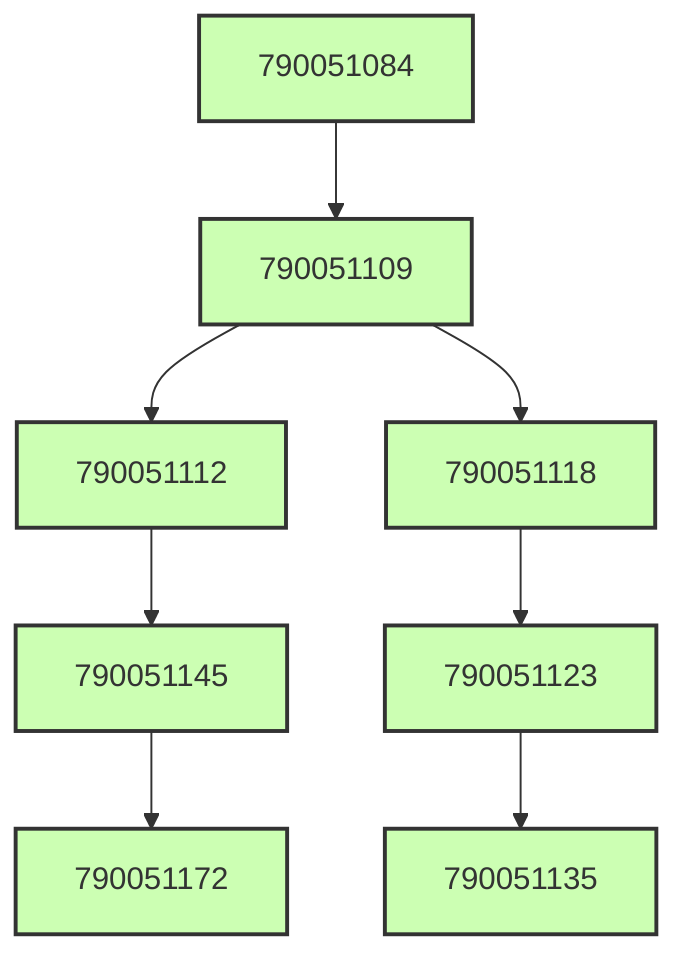

```mermaid
flowchart TD
%% Pellenc
            790051084 --> 790051109
            class 790051084,790051109 green
            
%% Evrard
            790051109 --> 790051112
            class 790051109,790051112 green
            
%% AGCO
            790051112 --> 790051145
            class 790051112,790051145 green
            
%% AGCO
            790051145 --> 790051172
            class 790051145,790051172 green
            
%% Pellenc
            790051109 --> 790051118
            class 790051109,790051118 green
            
%% Pellenc
            790051118 --> 790051123
            class 790051118,790051123 green
            
%% Pellenc
            790051123 --> 790051135
            class 790051123,790051135 green
            
classDef green fill:#ccffb3,stroke:#333,stroke-width:2px
```