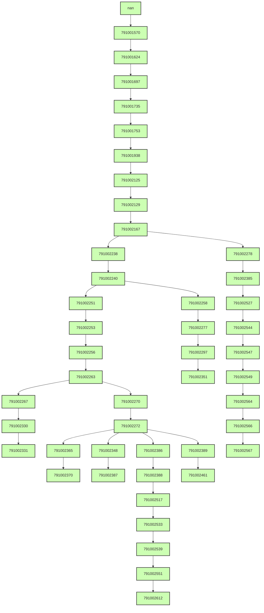

```mermaid
flowchart TD
%% SAF
            nan --> 791001570
            class nan,791001570 green
            
%% SAF
            791001570 --> 791001624
            class 791001570,791001624 green
            
%% SAF
            791001624 --> 791001697
            class 791001624,791001697 green
            
%% SAF
            791001697 --> 791001735
            class 791001697,791001735 green
            
%% PH
            791001735 --> 791001753
            class 791001735,791001753 green
            
%% PH
            791001753 --> 791001938
            class 791001753,791001938 green
            
%% Kubota
            791001938 --> 791002125
            class 791001938,791002125 green
            
%% Kubota
            791002125 --> 791002129
            class 791002125,791002129 green
            
%% Kubota
            791002129 --> 791002167
            class 791002129,791002167 green
            
%% Kubota
            791002167 --> 791002238
            class 791002167,791002238 green
            
%% Kubota
            791002238 --> 791002240
            class 791002238,791002240 green
            
%% PH
            791002240 --> 791002251
            class 791002240,791002251 green
            
%% PH
            791002251 --> 791002253
            class 791002251,791002253 green
            
%% PH
            791002253 --> 791002256
            class 791002253,791002256 green
            
%% PH
            791002256 --> 791002263
            class 791002256,791002263 green
            
%% PH
            791002263 --> 791002270
            class 791002263,791002270 green
            
%% PH
            791002270 --> 791002272
            class 791002270,791002272 green
            
%% Hardi-Evrard
            791002272 --> 791002386
            class 791002272,791002386 green
            
%% Hardi-Evrard
            791002386 --> 791002388
            class 791002386,791002388 green
            
%% Hardi-Evrard
            791002388 --> 791002517
            class 791002388,791002517 green
            
%% Hardi-Evrard
            791002517 --> 791002533
            class 791002517,791002533 green
            
%% Hardi-Evrard
            791002533 --> 791002539
            class 791002533,791002539 green
            
%% Hardi-Evrard
            791002539 --> 791002551
            class 791002539,791002551 green
            
%% Hardi-Evrard
            791002551 --> 791002612
            class 791002551,791002612 green
            
%% Kubota
            791002240 --> 791002258
            class 791002240,791002258 green
            
%% kubota
            791002258 --> 791002277
            class 791002258,791002277 green
            
%% kubota
            791002277 --> 791002297
            class 791002277,791002297 green
            
%% kubota
            791002297 --> 791002351
            class 791002297,791002351 green
            
%% BATEMAN
            791002263 --> 791002267
            class 791002263,791002267 green
            
%% BATEMAN
            791002267 --> 791002330
            class 791002267,791002330 green
            
%% BATEMAN
            791002330 --> 791002331
            class 791002330,791002331 green
            
%% PH
            791002272 --> 791002389
            class 791002272,791002389 green
            
%% PH
            791002389 --> 791002461
            class 791002389,791002461 green
            
%% IANUS
            791002272 --> 791002348
            class 791002272,791002348 green
            
%% IANUS
            791002348 --> 791002387
            class 791002348,791002387 green
            
%% Krukowiak
            791002272 --> 791002365
            class 791002272,791002365 green
            
%% Krukowiak
            791002365 --> 791002370
            class 791002365,791002370 green
            
%% PH
            791002167 --> 791002278
            class 791002167,791002278 green
            
%% PH
            791002278 --> 791002385
            class 791002278,791002385 green
            
%% PH
            791002385 --> 791002527
            class 791002385,791002527 green
            
%% PH
            791002527 --> 791002544
            class 791002527,791002544 green
            
%% PH
            791002544 --> 791002547
            class 791002544,791002547 green
            
%% PH
            791002547 --> 791002549
            class 791002547,791002549 green
            
%% PH
            791002549 --> 791002564
            class 791002549,791002564 green
            
%% PH
            791002564 --> 791002566
            class 791002564,791002566 green
            
%% PH
            791002566 --> 791002567
            class 791002566,791002567 green
            
classDef green fill:#ccffb3,stroke:#333,stroke-width:2px
```