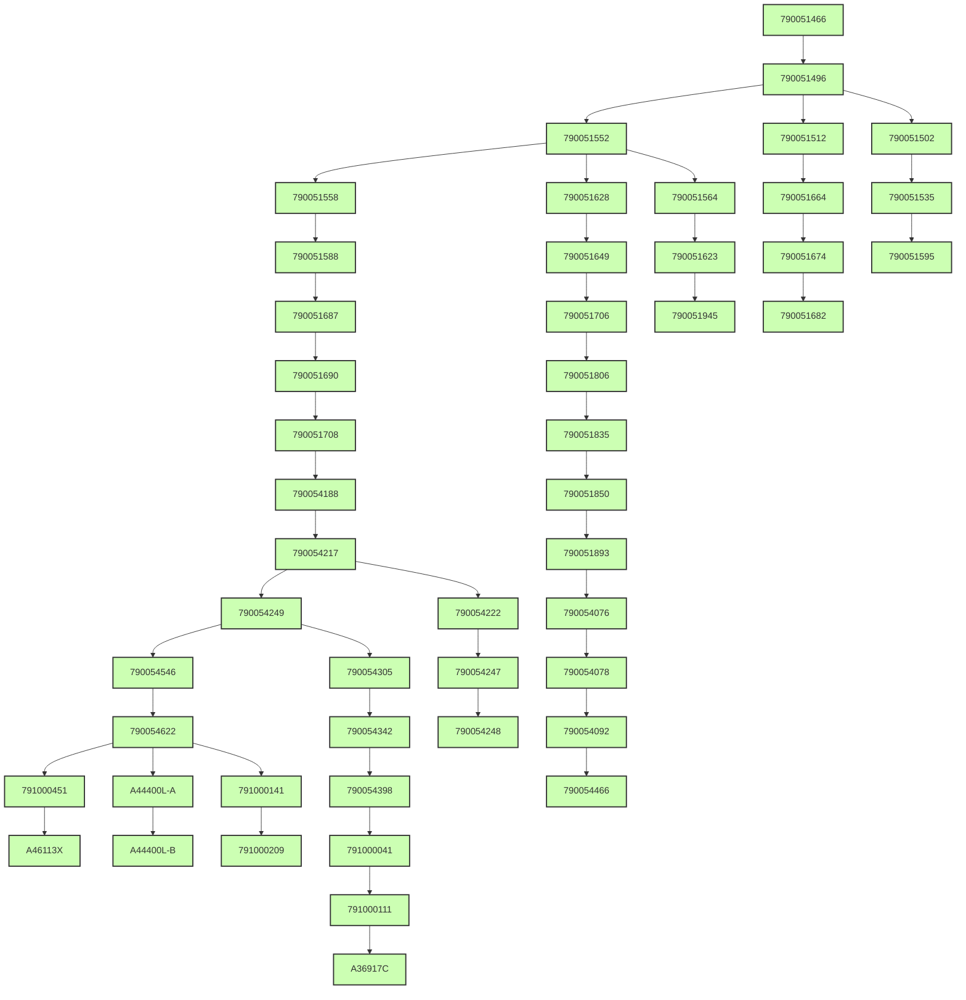

```mermaid
flowchart TD
%% nan
            790051466 --> 790051496
            class 790051466,790051496 green
            
%% nan
            790051496 --> 790051552
            class 790051496,790051552 green
            
%% ABG Ingersoll-Rand
            790051552 --> 790051558
            class 790051552,790051558 green
            
%% ABG Ingersoll-Rand
            790051558 --> 790051588
            class 790051558,790051588 green
            
%% ABG Ingersoll-Rand
            790051588 --> 790051687
            class 790051588,790051687 green
            
%% ABG Ingersoll-Rand
            790051687 --> 790051690
            class 790051687,790051690 green
            
%% ABG Ingersoll-Rand
            790051690 --> 790051708
            class 790051690,790051708 green
            
%% Hardi Evrard
            790051708 --> 790054188
            class 790051708,790054188 green
            
%% SBS
            790054188 --> 790054217
            class 790054188,790054217 green
            
%% SBS
            790054217 --> 790054249
            class 790054217,790054249 green
            
%% Tous
            790054249 --> 790054546
            class 790054249,790054546 green
            
%% Tous
            790054546 --> 790054622
            class 790054546,790054622 green
            
%% Hardi Evrard
            790054622 --> 791000451
            class 790054622,791000451 green
            
%% Hardi Evrard
            791000451 --> A46113X
            class 791000451,A46113X green
            
%% Caterpillar
            790051552 --> 790051628
            class 790051552,790051628 green
            
%% Préciculture
            790051628 --> 790051649
            class 790051628,790051649 green
            
%% Herriau
            790051649 --> 790051706
            class 790051649,790051706 green
            
%% Herriau
            790051706 --> 790051806
            class 790051706,790051806 green
            
%% Préciculture
            790051806 --> 790051835
            class 790051806,790051835 green
            
%% Entracon
            790051835 --> 790051850
            class 790051835,790051850 green
            
%% Jack Rabbit
            790051850 --> 790051893
            class 790051850,790051893 green
            
%% CML
            790051893 --> 790054076
            class 790051893,790054076 green
            
%% Miller
            790054076 --> 790054078
            class 790054076,790054078 green
            
%% Nairn
            790054078 --> 790054092
            class 790054078,790054092 green
            
%% Herriau
            790054092 --> 790054466
            class 790054092,790054466 green
            
%% Ingersoll-Rand
            790051552 --> 790051564
            class 790051552,790051564 green
            
%% Dammann
            790051564 --> 790051623
            class 790051564,790051623 green
            
%% Dammann
            790051623 --> 790051945
            class 790051623,790051945 green
            
%% Barigelli
            790051496 --> 790051512
            class 790051496,790051512 green
            
%% Caterpillar
            790051512 --> 790051664
            class 790051512,790051664 green
            
%% Caterpillar
            790051664 --> 790051674
            class 790051664,790051674 green
            
%% Caterpillar
            790051674 --> 790051682
            class 790051674,790051682 green
            
%% nan
            790051496 --> 790051502
            class 790051496,790051502 green
            
%% nan
            790051502 --> 790051535
            class 790051502,790051535 green
            
%% nan
            790051535 --> 790051595
            class 790051535,790051595 green
            
%% FMC
            790054217 --> 790054222
            class 790054217,790054222 green
            
%% FMC
            790054222 --> 790054247
            class 790054222,790054247 green
            
%% FMC
            790054247 --> 790054248
            class 790054247,790054248 green
            
%% SBS
            790054249 --> 790054305
            class 790054249,790054305 green
            
%% SBS
            790054305 --> 790054342
            class 790054305,790054342 green
            
%% SBS
            790054342 --> 790054398
            class 790054342,790054398 green
            
%% SBS
            790054398 --> 791000041
            class 790054398,791000041 green
            
%% SBS
            791000041 --> 791000111
            class 791000041,791000111 green
            
%% Santa Barbara
            791000111 --> A36917C
            class 791000111,A36917C green
            
%% Breaker Technology Industry
            790054622 --> A44400L-A
            class 790054622,A44400L-A green
            
%% BTI
            A44400L-A --> A44400L-B
            class A44400L-A,A44400L-B green
            
%% CMC-Préciculture
            790054622 --> 791000141
            class 790054622,791000141 green
            
%% CMC-Préciculture
            791000141 --> 791000209
            class 791000141,791000209 green
            
classDef green fill:#ccffb3,stroke:#333,stroke-width:2px
```